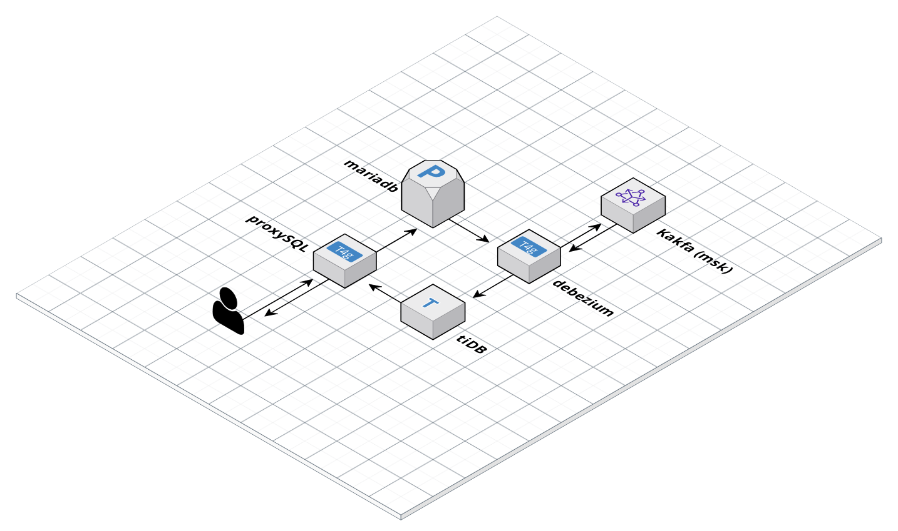

# Terraform AWS, Debezium, proxySQL and TiDB

 Deploy Debezium and Kafka to perform ongoing change data capture (CDC) from your existing mysql/mariadb database to populate tiDB. Then use ProxySQL to allow you to test the features and performance of TiDB alongside your existing mySQL or MariaDB database. Write data to one database and read from the other.



To deploy this project you will need:

* [Packer](https://www.packer.io/) (tested on v1.8.5)
* [Terraform](https://www.terraform.io/) (tested on v1.4.2)
* [Ansible](https://docs.ansible.com/ansible/latest/installation_guide/index.html) ( tested on v2.14.2)
* An [AWS account](https://aws.amazon.com/free/)


### Estimated monthly costs

(Powered by Infracost)

```
Project: gordonmurray/terraform_aws_debezium_proxysql_tidb

 Name                                                             Monthly Qty  Unit                    Monthly Cost

 aws_cloudwatch_log_group.kafka_broker_logs
 ├─ Data ingested                                           Monthly cost depends on usage: $0.57 per GB
 ├─ Archival Storage                                        Monthly cost depends on usage: $0.03 per GB
 └─ Insights queries data scanned                           Monthly cost depends on usage: $0.0057 per GB

 aws_db_instance.default
 ├─ Database instance (on-demand, Single-AZ, db.t4g.micro)                730  hours                         $12.41
 ├─ Storage (general purpose SSD, gp2)                                     20  GB                             $2.54
 └─ Additional backup storage                               Monthly cost depends on usage: $0.095 per GB

 aws_instance.debezium
 ├─ Instance usage (Linux/UNIX, on-demand, t4g.small)                     730  hours                         $13.43
 └─ root_block_device
    └─ Storage (general purpose SSD, gp2)                                  10  GB                             $1.10

 aws_instance.proxysql
 ├─ Instance usage (Linux/UNIX, on-demand, t4g.small)                     730  hours                         $13.43
 └─ root_block_device
    └─ Storage (general purpose SSD, gp2)                                  10  GB                             $1.10

 aws_kms_key.cloudwatch_key
 ├─ Customer master key                                                     1  months                         $1.00
 ├─ Requests                                                Monthly cost depends on usage: $0.03 per 10k requests
 ├─ ECC GenerateDataKeyPair requests                        Monthly cost depends on usage: $0.10 per 10k requests
 └─ RSA GenerateDataKeyPair requests                        Monthly cost depends on usage: $0.10 per 10k requests

 aws_kms_key.kafka_key
 ├─ Customer master key                                                     1  months                         $1.00
 ├─ Requests                                                Monthly cost depends on usage: $0.03 per 10k requests
 ├─ ECC GenerateDataKeyPair requests                        Monthly cost depends on usage: $0.10 per 10k requests
 └─ RSA GenerateDataKeyPair requests                        Monthly cost depends on usage: $0.10 per 10k requests

 aws_kms_key.rds_key
 ├─ Customer master key                                                     1  months                         $1.00
 ├─ Requests                                                Monthly cost depends on usage: $0.03 per 10k requests
 ├─ ECC GenerateDataKeyPair requests                        Monthly cost depends on usage: $0.10 per 10k requests
 └─ RSA GenerateDataKeyPair requests                        Monthly cost depends on usage: $0.10 per 10k requests

 aws_kms_key.secrets_manager
 ├─ Customer master key                                                     1  months                         $1.00
 ├─ Requests                                                Monthly cost depends on usage: $0.03 per 10k requests
 ├─ ECC GenerateDataKeyPair requests                        Monthly cost depends on usage: $0.10 per 10k requests
 └─ RSA GenerateDataKeyPair requests                        Monthly cost depends on usage: $0.10 per 10k requests

 aws_msk_cluster.kafka
 └─ Instance (kafka.t3.small)                                           2,190  hours                        $109.28

 aws_secretsmanager_secret.example
 ├─ Secret                                                                  1  months                         $0.40
 └─ API requests                                            Monthly cost depends on usage: $0.05 per 10k requests

 aws_secretsmanager_secret.msk
 ├─ Secret                                                                  1  months                         $0.40
 └─ API requests                                            Monthly cost depends on usage: $0.05 per 10k requests

 OVERALL TOTAL                                                                                              $158.10
──────────────────────────────────
30 cloud resources were detected:
∙ 11 were estimated, 6 of which include usage-based costs, see https://infracost.io/usage-file
∙ 19 were free:
  ∙ 8 x aws_security_group_rule
  ∙ 4 x aws_security_group
  ∙ 2 x aws_secretsmanager_secret_version
  ∙ 1 x aws_db_option_group
  ∙ 1 x aws_db_parameter_group
  ∙ 1 x aws_db_subnet_group
  ∙ 1 x aws_key_pair
  ∙ 1 x aws_msk_configuration
```

### Security

(powered by TFsec)

```
  results
  ──────────────────────────────────────────
  passed               37
  ignored              0
  critical             0
  high                 1
  medium               0
  low                  1

  37 passed, 2 potential problem(s) detected.

* Result #1 HIGH Cluster allows plaintext communication.
* Result #2 LOW Instance does not have performance insights enabled.
```